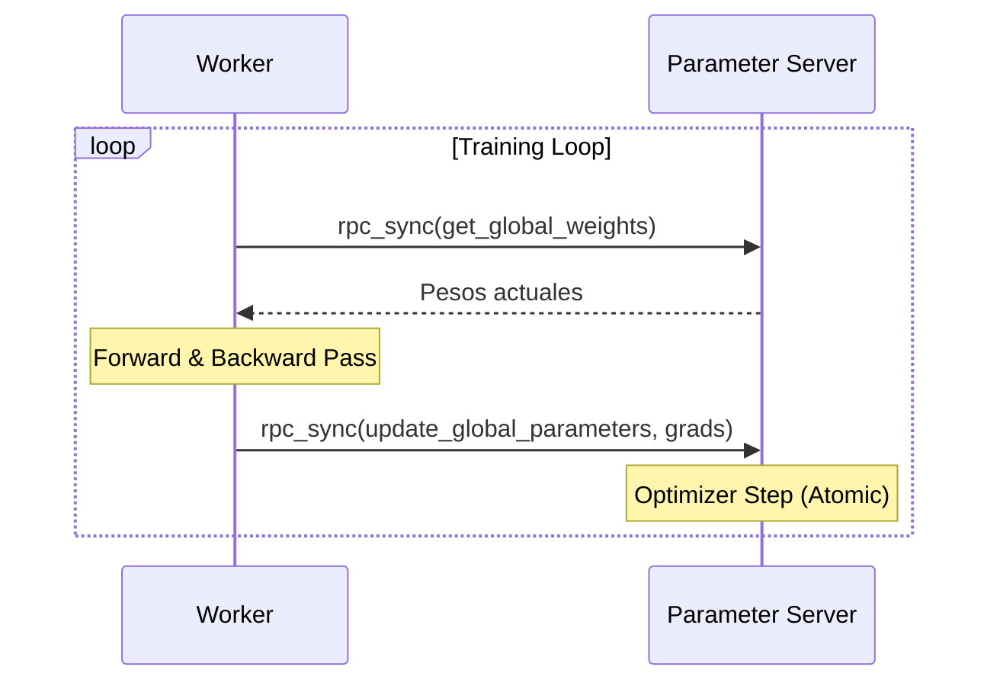

# Asynchronous Distributed Training (ImageNet1k)

Este proyecto implementa un sistema de entrenamiento distribuido asíncrono para modelos de Deep Learning (ResNet50) sobre ImageNet/Tiny-ImageNet, utilizando `torch.distributed.rpc`.

## Arquitectura

El sistema sigue el patrón de diseño **Parameter Server (PS)**.

### Componentes Principales

1.  **Parameter Server (`src/rpc_ps.py`)**
    *   Actúa como la autoridad central para los pesos del modelo.
    *   Mantiene el modelo global y el optimizador.
    *   Recibe gradientes de los workers y actualiza los pesos de forma atómica (thread-safe).
    *   Permite a los workers leer los pesos más recientes (incluso si son ligeramente "stale" debido a la asincronía).

2.  **Worker (`src/rpc_worker.py`)**
    *   Realiza el entrenamiento efectivo.
    *   **Ciclo de vida**:
        1.  **Pull**: Obtiene los pesos globales del PS.
        2.  **Train**: Ejecuta forward y backward pass con un lote de datos local.
        3.  **Push**: Envía los gradientes calculados al PS.
    *   Los workers operan de forma independiente y asíncrona.

3.  **Manejo de Datos (`src/dataset.py`)**
    *   Utiliza **WebDataset** para hacer streaming de datos directamente desde Google Cloud Storage (GCS).
    *   Permite escalar a datasets masivos sin requerir almacenamiento local grande en cada nodo.

4.  **Simulación Local (`src/local_simulation.py`)**
    *   Script para probar la arquitectura en una sola máquina utilizando `torch.multiprocessing`.
    *   Lanza procesos separados para el PS y los Workers, comunicándose vía RPC sobre `localhost`.

## Flujo de Trabajo



## Ejecución

### Simulación Local

Para correr una simulación con 1 PS y 1 Worker en tu máquina local:

```bash
python -m src.local_simulation
```

### Despliegue Distribuido

Para ejecutar en múltiples nodos, se debe iniciar el script correspondiente en cada máquina configurando `MASTER_ADDR` y `MASTER_PORT` para que apunten al nodo del PS.

*   **Nodo PS**:
    ```bash
    python -m src.rpc_ps --rank 0 --world_size <N>
    ```
*   **Nodo Worker**:
    ```bash
    python -m src.rpc_worker --rank <RANK> --world_size <N> --dataset_url <URL>
    ```

## Recolección de Estadísticas

El sistema incluye un módulo de recolección de estadísticas (`src/stats_collector.py`) que genera logs detallados para análisis posterior.

### Datos Recolectados

Cada nodo (PS y Workers) crea automáticamente una carpeta en `stats/{nombre_nodo}/` con los siguientes archivos:

1.  **`system_stats.csv`**: Uso de recursos de hardware.
    *   CPU (%), Memoria (%), Red Enviada (MB), Red Recibida (MB).
2.  **`training_metrics.csv`** (Solo Workers): Métricas de entrenamiento.
    *   Epoch, Batch, Loss, Accuracy.
3.  **`parameters.json`**: Metadatos de configuración.
    *   Hiperparámetros, rol del nodo, dispositivo usado.

### Requisitos

Para habilitar la recolección de estadísticas de hardware, se requiere instalar `psutil`:

```bash
pip install psutil
```
